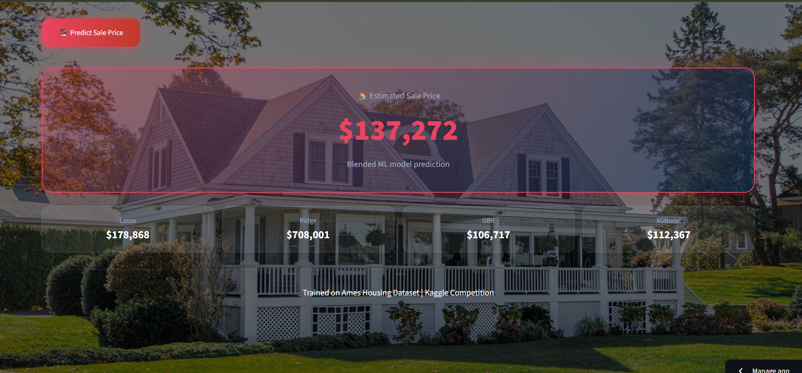

<div align="center">

# 🏠 House Price Predictor
### AI-Powered House Price Prediction using Ensemble Machine Learning

*Estimating residential property prices from housing characteristics using a weighted ensemble of four regression models.*

[](https://house-price-predictor-yogesh.streamlit.app)
[](https://colab.research.google.com/drive/1PQ9VnlQTdMaqIzZKfXQ9QMxKPg3A7KrO)
[](https://python.org)
[](https://streamlit.io)
[](https://xgboost.readthedocs.io)

**[🔗 Try the Live App](https://house-price-predictor-yogesh.streamlit.app)** &nbsp;·&nbsp; **[📓 View Training Notebook](https://colab.research.google.com/drive/1PQ9VnlQTdMaqIzZKfXQ9QMxKPg3A7KrO)**

</div>

<br>

---

## 📖 Table of Contents

- [Overview](#-overview)
- [Why I Built This](#-why-i-built-this)
- [Screenshots](#-screenshots)
- [How It Works](#-how-it-works)
- [The Ensemble Model](#-the-ensemble-model)
- [Dataset & Methodology](#-dataset--methodology)
- [Tech Stack](#-tech-stack)
- [Project Structure](#-project-structure)
- [Running Locally](#-running-locally)
- [Deployment](#-deployment)
- [Limitations & Future Work](#-limitations--future-work)
- [Author](#-author)

---

## 🌐 Overview

House Price Predictor is an end-to-end machine learning web application that estimates residential property prices from housing characteristics — living area, basement size, construction year, garage capacity, quality ratings, bathrooms, fireplaces, and several engineered features.

Rather than relying on a single model, predictions come from a **weighted ensemble of four regressors** — Lasso, Ridge, Gradient Boosting, and XGBoost — trained on the Ames Housing dataset from Kaggle. Users enter property details through a Streamlit interface and get an instant price estimate.

## 💡 Why I Built This

*[Note: swap this in with your own words on what got you interested in this project — even a sentence or two works well.]*

I built this to get hands-on experience deploying ML models beyond a notebook — the goal wasn't just training a regressor, it was building the full pipeline: preprocessing, feature engineering, model comparison, ensembling, a working web interface, and cloud deployment. Getting scikit-learn version pinning and Python runtime configuration right on Streamlit Cloud taught me as much about deployment as the modeling did.

---

## 📸 Screenshots

<div align="center">

### Home Screen


### Prediction Page


</div>

---

## ⚙️ How It Works

```
      Housing Features (living area, quality, garage, etc.)
                          │
                          ▼
                Feature Engineering
   (Total SqFt, House Age, Remodel Age, Garage/Basement flags)
                          │
                          ▼
                    Data Scaling
                          │
          ┌───────────────┼───────────────┐
          ▼               ▼               ▼
       Lasso     Gradient Boosting     XGBoost
          │               │               │
          └───────────────┼───────────────┘
                          ▼
              Weighted Ensemble
        0.40·Lasso + 0.30·GBR + 0.30·XGBoost
                          │
                          ▼
              Predicted House Price
                          │
                          ▼
              Streamlit Web Interface
```

---

## 🤖 The Ensemble Model

| Model | Role |
|---|---|
| **Lasso Regression** | Linear baseline with L1 regularization — dominant weight in the final blend |
| **Ridge Regression** | Trained and evaluated, but **dropped from the final ensemble** — unstable on the sparse, high-dimensional encoded feature set |
| **Gradient Boosting Regressor** | Captures non-linear relationships between features |
| **XGBoost Regressor** | High-performance gradient boosting, tuned for this dataset |

**Final blend formula:**
```
prediction = 0.40 × Lasso + 0.30 × Gradient Boosting + 0.30 × XGBoost
```

Ridge was trained alongside the others during experimentation but excluded from the final ensemble after it proved less stable on this dataset's sparse, one-hot-encoded feature space — the weighting above reflects what actually generalized best on held-out data.

**Current Kaggle leaderboard score:** 0.12601 (RMSE on log-transformed price) — actively being iterated toward a target of 0.115.

---

## 🔬 Dataset & Methodology

Built on the **Ames Housing Dataset** (Kaggle), one of the most widely used benchmarks for house price regression.

**Workflow:**
1. Data cleaning & missing value handling
2. Categorical feature encoding
3. Feature engineering — Total Square Footage, House Age, Remodel Age, Garage/Basement/Fireplace availability flags
4. Feature scaling (RobustScaler)
5. Training and comparing Lasso, Ridge, Gradient Boosting, and XGBoost
6. Selecting the best-performing weighted blend based on validation error
7. Model serialization with Joblib
8. Streamlit deployment

Training was done in Google Colab, with the trained models exported as `.pkl` files for the Streamlit app to load directly — no retraining happens at inference time.

---

## 🛠️ Tech Stack

| Layer | Tools |
|---|---|
| **ML / Modeling** | Scikit-learn (Lasso, Ridge, GBR), XGBoost |
| **Data Processing** | Pandas, NumPy |
| **Model Persistence** | Joblib |
| **Web App** | Streamlit |
| **Deployment** | Streamlit Community Cloud |

---

## 📁 Project Structure

```
House-Price-Predictor/
├── Images/                      # Screenshots used in this README
│   ├── Home Screen.png
│   └── Prediction.png
├── app.py                       # Streamlit app entry point
├── model_lasso.pkl              # Trained Lasso model
├── model_gbr.pkl                # Trained Gradient Boosting model
├── model_xgb.pkl                # Trained XGBoost model
├── model_ridge.pkl              # Trained Ridge model (kept for reference, not in final blend)
├── scaler.pkl                   # RobustScaler used at inference
├── feature_columns.pkl          # Expected feature column order
├── requirements.txt
├── runtime.txt                  # Pins Python version for scikit-learn compatibility
└── .gitignore
```

---

## 🚀 Running Locally

```bash
git clone https://github.com/Yogeshyadav870/House-Price-Predictor.git
cd House-Price-Predictor
pip install -r requirements.txt
streamlit run app.py
```

> **Note:** the pickled models were trained with a specific scikit-learn version — check `requirements.txt` for the exact pin (`scikit-learn==1.6.1`) and `runtime.txt` for the matching Python version, since mismatches will cause `ModuleNotFoundError` on load.

---

## ☁️ Deployment

Deployed on **Streamlit Community Cloud**:

1. Push to GitHub
2. Connect the repo on [share.streamlit.io](https://share.streamlit.io) → point to `app.py`
3. Set the Python version in app **Settings** to match `runtime.txt` (Streamlit Cloud's dashboard setting takes priority over the file itself)

---

## 🔭 Limitations & Future Work

- Kaggle score (0.12601) has room to improve toward the 0.115 target — likely through further feature engineering or stacking rather than just reweighting the existing ensemble
- No confidence intervals on predictions currently — adding prediction ranges (not just point estimates) would make outputs more honest
- No SHAP-based explainability yet — showing *why* a prediction landed where it did would make the tool more useful, not just accurate
- Currently single-prediction only — batch prediction via CSV upload is a natural next feature
- No prediction history / logging — currently every prediction is stateless

---

## 👤 Author

**Yogesh Yadav**
B.Tech CSE · Lovely Professional University (2023–2027)

[](https://github.com/Yogeshyadav870)

<sub>⭐ If you found this project useful, consider giving it a star.</sub>
